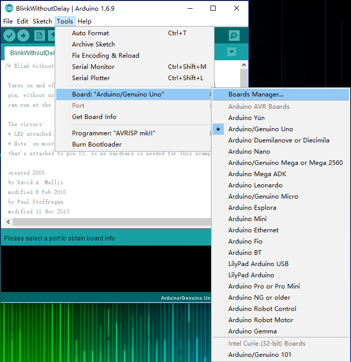
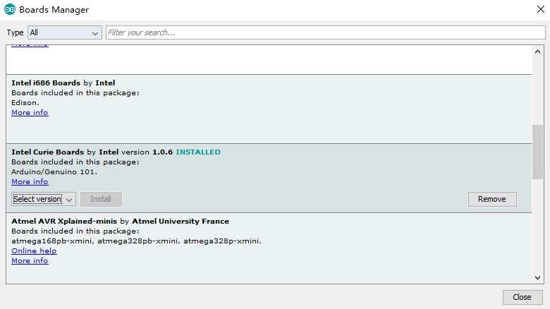
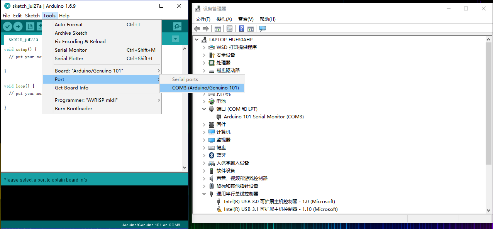
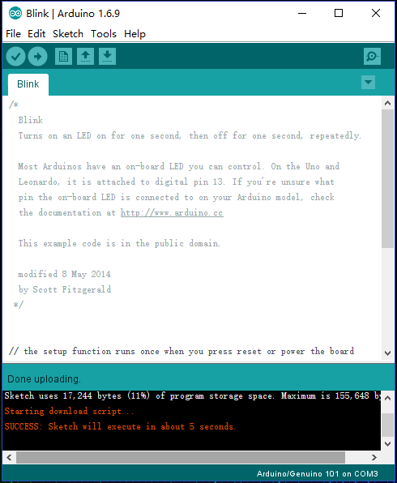
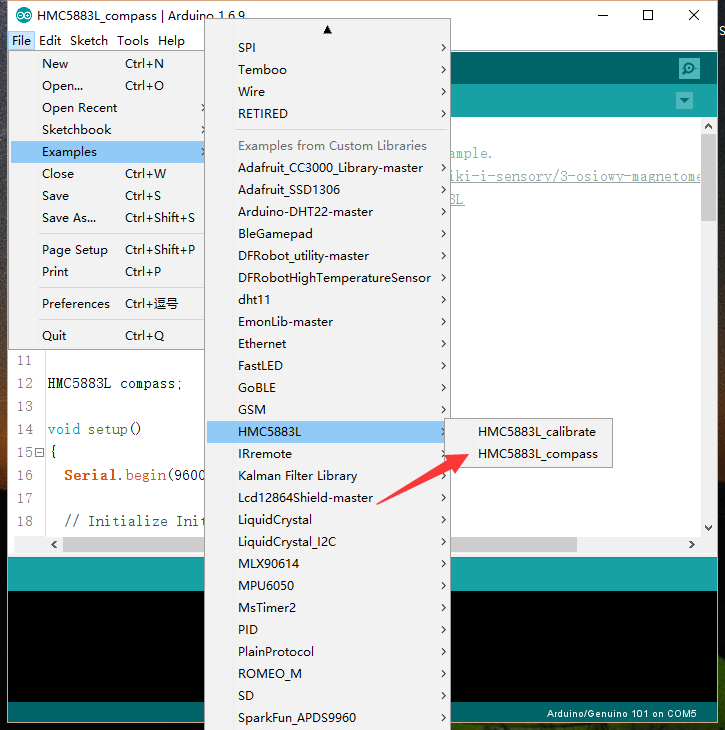
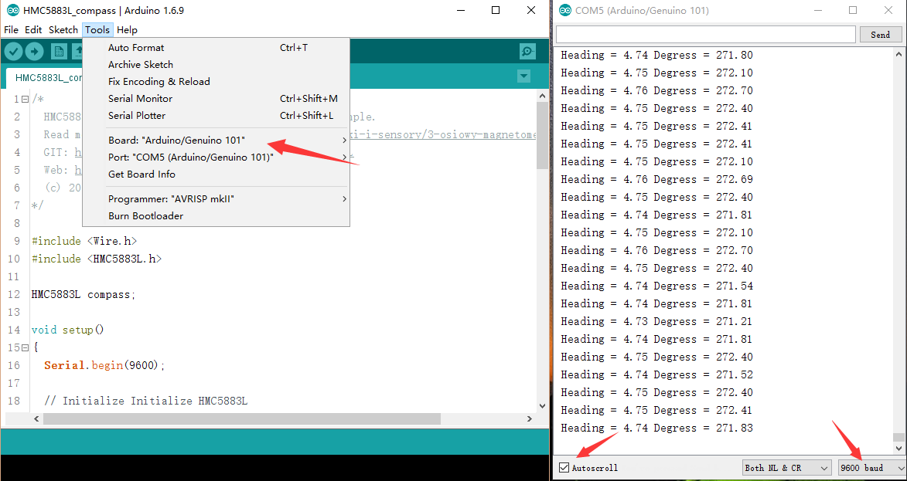

# CurieNanoTest

The CurieNano is a small development tool based on the Intel® Curie™ module. It is easy to use and perfectly compatible with the Genuino/Arduino 101. The small size allows it to better fit your project's development and creation and makes it ideal for wearable tech and small prototypes. The Intel Curie module contains a x86 quark core and a 32bit ARC architecture core (Zephyr), integrated Bluetooth 4.0 and 6 axis attitude sensor. The module's clock frequency is0 32MHZ and the cross tool chain of Intel can support the development of two cores. The Intel Curie includes dual core storage and users are able to use 196Kb Flash (total 384Kb) and 24Kb SRAM (total 80Kb). It is more than sufficient for most development scenarios with the added bonus of Intel's strong support network to aid your development.

Specification
Control Chip: Intel Curie
BAT Port Power Supply Voltage: 3.5V-6.5V
5V Port Voltage: 4.5V-5.5V
3V3 Port Voltage: 2.97V-3.63V
Digital IO Ports: 15 (including 4 PWM pins D3, D5, D6, D9,)
Analog IO Input: 6
IO Port DC Drive Current: 20mA
Integrated Bluetooth 4.0
Integrated 6 axis accelerometer and 3 axis electronic compass on board, full inertial navigation
Onboard boost circuit can provide 1.5A@5v sensor power supply when using lithium battery supply
Clock speed: 32Mhz
Compatible with Arduino IDE 1.6.7 or above
Bootloader: Arduino/Genuino 101
Board Overview
DFR0453_CurieNanoPinoutEN.png Function Description:

Onboard D13 LED, ERR and COM light
Onboard TI TPS61020 boost circuit
Extended D20 Digital Pin
Tutorial
CurieNano is perfectly compatible with all the features of Arduino/Genuino 101 with the bonus of added features.

Requirements
Hardware
CurieNano x1
Micro USB x1
Software
Arduino IDE V1.6.9 Click to Download Arduino IDE from Arduino®
warning_yellow.png NOTE: This is based on the Intel Curie motherboard design. When developing in Arduino IDE you will need to add it's extension plug-in. If you have Arduino 1.6.7 IDE or above, you can skip the reload step.

Install Arduino/Genuino 101 Plug-in
Open Arduino IDE, select "Tools" in the menu bar, click "Board" to open the board manager and install the Intel Curie motherboard programming libraries and drivers.

In the pop-up window of the board manager find "Intel Curie Boards by Intel version...", at the bottom left, select the latest version of the "select version", and click on install. When it is installed successfully you will see the following image.

After the successful installation of Intel Curie Boards of plug-in and driver package, you should find Intel Curie in the "Board" menu. You may now program for all based Curie development board.

warning_yellow.png NOTE: If you want to install the driver manually, it is located in your C:\Users\YourUserName\AppData\Local\Arduino15\packages\Intel\tools\arduino101load\1.6.9 1.24\drivers folder.

CurieNano Example Program
Once you have successfully installed the development environment, programming the CurieNano the same as using an Arduino. The following is a brief tutorial:

Open Arduino IDE and connect the CurieNano using a MicroUSB cable. The system should automatically install Arduino 101 drivers and identify CurieNano COM port at the bottom right of the window.

Open the famous "Blink" Example program. Under "Board" select Arduino 101. Under "port" select the corresponding COM port. Finally click "upload" to upload the sample program.

If your upload was successful you should see this:

Click to view: [CurieNano(Arduino/Genuino101)Bluetooth, Accelerometer Gyroscope, and Real-Time Clock Libraries](https://www.arduino.cc/en/Guide/Arduino101#toc3)

Click to view: [CurieNano Advanced Tutorial(Step Count, Shock detection and Heart Rate Monitor,etc.)](https://www.arduino.cc/en/Guide/Arduino101#toc8)

CurieNano Project Development
The CurieNano is designed to be compatible with Arduino 101. Use a 3.7V lithium battery-power to use the Batt interface Curie is ideal for small prototype projects, such as wearables, IoT Bluetooth sensor nodes and robotics projects'''.

Onboard Electronic Compass
HMC5883L/QMC5883 libraries About Library installation.

Download "DFRobot-QMC5883-master.zip" and unpack it, copy the DFRobot-QMC5883-master folder to the Libraries folder of Arduino and then open Arduino IDE. From "File -> Examples -> QMC5883 -> QMC5883_compass" to open "QMC5883_compass.ino", select your "board" and "port" and upload to the CurieNano in the same way you uploaded the blink sketch.

Wait five seconds after the download is complete, open the serial monitor port and set the baud rate 9600. Rotate the CurieNano board and you should see the angle change.

